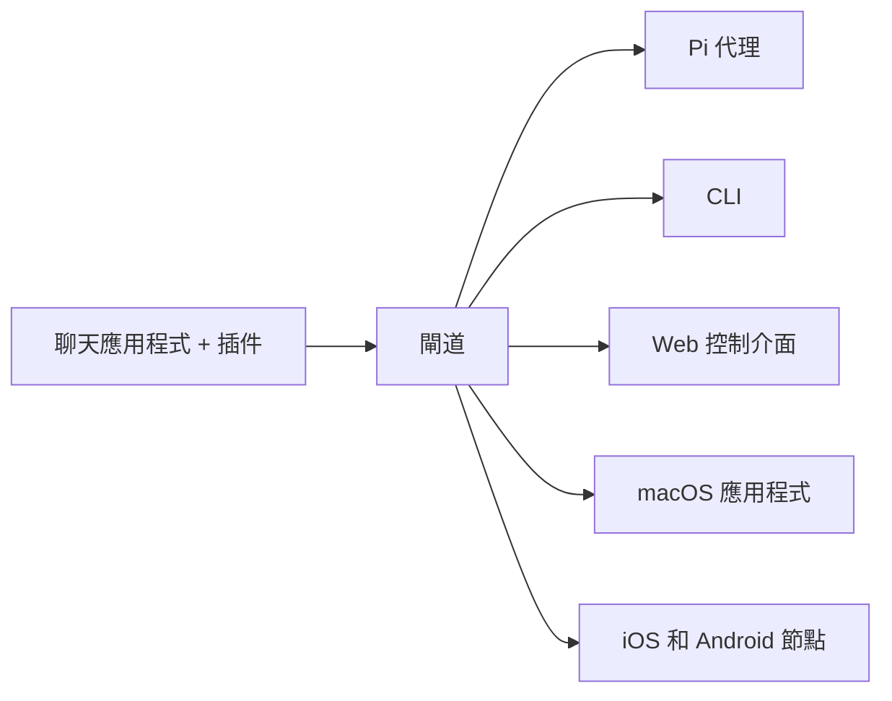

# OpenClaw 🦞

<p align="center">
    
    
</p>

> _"EXFOLIATE! EXFOLIATE!"_ — 一隻太空龍蝦，可能吧

<p align="center">
  <strong>適用於 WhatsApp、Telegram、Discord、iMessage 等的任何作業系統 AI 代理閘道。</strong><br />
  發送訊息，從口袋中獲得代理回應。插件可添加 Mattermost 等更多功能。
</p>

<Columns>
  <Card title="開始使用" href="/start/getting-started" icon="rocket">
    安裝 OpenClaw 並在幾分鐘內啟動閘道。
  </Card>
  <Card title="執行精靈" href="/start/wizard" icon="sparkles">
    使用 `openclaw onboard` 和配對流程進行引導設置。
  </Card>
  <Card title="開啟控制介面" href="/web/control-ui" icon="layout-dashboard">
    啟動瀏覽器儀表板以進行聊天、配置和會話。
  </Card>
</Columns>

## 什麼是 OpenClaw？

OpenClaw 是一個**自我託管的閘道**，將您喜愛的聊天應用程式 — WhatsApp、Telegram、Discord、iMessage 等 — 連接到像 Pi 這樣的 AI 編碼代理。您可以在自己的機器（或伺服器）上執行單一的閘道程序，它成為您的消息應用程式與隨時可用的 AI 助手之間的橋樑。

**適合誰？** 開發者和高級用戶，他們希望擁有一個可以從任何地方發送訊息的個人 AI 助手 — 而不必放棄對其數據的控制或依賴託管服務。

**有何不同？**

- **自我託管**：在您的硬體上執行，遵循您的規則
- **多通道**：一個閘道同時服務於 WhatsApp、Telegram、Discord 等
- **代理原生**：為編碼代理構建，具有工具使用、會話、記憶和多代理路由
- **開源**：MIT 許可，社群驅動

**需要什麼？** 建議使用 Node 24，或 Node 22 LTS (`22.16+`) 以確保相容性，從您選擇的提供者獲取 API 金鑰，以及 5 分鐘的時間。為了獲得最佳品質和安全性，請使用最強的最新一代模型。

## 運作原理



閘道是會話、路由和通道連接的單一真實來源。

## 主要功能

<Columns>
  <Card title="多通道閘道" icon="network">
    使用單一閘道程序連接 WhatsApp、Telegram、Discord 和 iMessage。
  </Card>
  <Card title="插件通道" icon="plug">
    使用擴展套件添加 Mattermost 等更多功能。
  </Card>
  <Card title="多代理路由" icon="route">
    每個代理、工作區或發送者的隔離會話。
  </Card>
  <Card title="媒體支援" icon="image">
    發送和接收圖片、音訊和文件。
  </Card>
  <Card title="Web 控制介面" icon="monitor">
    用於聊天、配置、會話和節點的瀏覽器儀表板。
  </Card>
  <Card title="行動節點" icon="smartphone">
    配對 iOS 和 Android 節點以進行 Canvas、相機和語音啟用的工作流程。
  </Card>
</Columns>

## 快速開始

<Steps>
  <Step title="安裝 OpenClaw">
    ```bash
    npm install -g openclaw@latest
    ```
  </Step>
  <Step title="引導並安裝服務">
    ```bash
    openclaw onboard --install-daemon
    ```
  </Step>
  <Step title="配對 WhatsApp 並啟動閘道">
    ```bash
    openclaw channels login
    openclaw gateway --port 18789
    ```
  </Step>
</Steps>

需要完整的安裝和開發設置？請參閱[快速開始](/start/quickstart)。

## 儀表板

閘道啟動後，開啟瀏覽器控制介面。

- 本地預設：[http://127.0.0.1:18789/](http://127.0.0.1:18789/)
- 遠端存取：[Web 界面](/web) 和 [Tailscale](/gateway/tailscale)

<p align="center">
  
</p>

## 配置（可選）

配置位於 `~/.openclaw/openclaw.json`。

- 如果您**不做任何操作**，OpenClaw 將使用捆綁的 Pi 二進位檔案以 RPC 模式執行，並提供每個發送者的會話。
- 如果您想要鎖定它，請從 `channels.whatsapp.allowFrom` 開始，並（對於群組）提及規則。

範例：

```json5
{
  channels: {
    whatsapp: {
      allowFrom: ["+15555550123"],
      groups: { "*": { requireMention: true } },
    },
  },
  messages: { groupChat: { mentionPatterns: ["@openclaw"] } },
}
```

## 從這裡開始

<Columns>
  <Card title="文件中心" href="/start/hubs" icon="book-open">
    所有文件和指南，按使用案例組織。
  </Card>
  <Card title="配置" href="/gateway/configuration" icon="settings">
    核心閘道設置、令牌和提供者配置。
  </Card>
  <Card title="遠端存取" href="/gateway/remote" icon="globe">
    SSH 和 tailnet 存取模式。
  </Card>
  <Card title="通道" href="/channels/telegram" icon="message-square">
    WhatsApp、Telegram、Discord 等的通道特定設置。
  </Card>
  <Card title="節點" href="/nodes" icon="smartphone">
    iOS 和 Android 節點的配對、Canvas、相機和設備操作。
  </Card>
  <Card title="幫助" href="/help" icon="life-buoy">
    常見修復和故障排除入口。
  </Card>
</Columns>

## 瞭解更多

<Columns>
  <Card title="完整功能列表" href="/concepts/features" icon="list">
    完整的通道、路由和媒體功能。
  </Card>
  <Card title="多代理路由" href="/concepts/multi-agent" icon="route">
    工作區隔離和每個代理的會話。
  </Card>
  <Card title="安全性" href="/gateway/security" icon="shield">
    令牌、允許清單和安全控制。
  </Card>
  <Card title="故障排除" href="/gateway/troubleshooting" icon="wrench">
    閘道診斷和常見錯誤。
  </Card>
  <Card title="關於和致謝" href="/reference/credits" icon="info">
    專案起源、貢獻者和許可。
  </Card>
</Columns>
